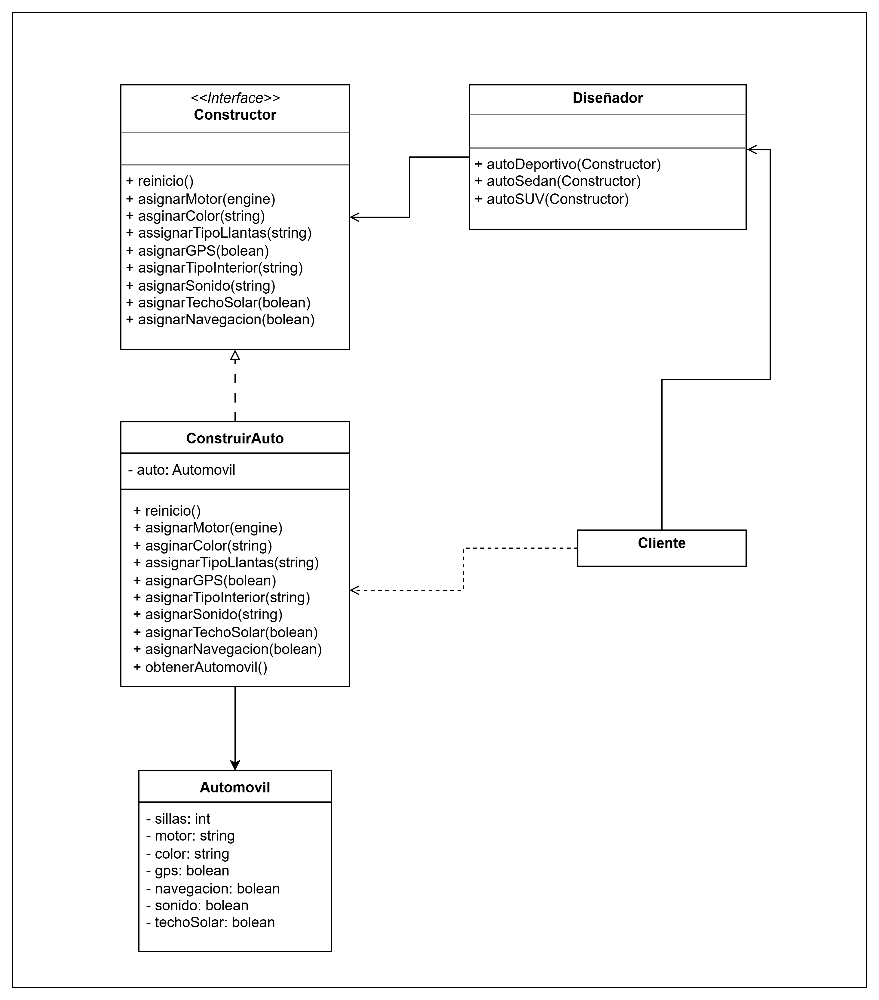
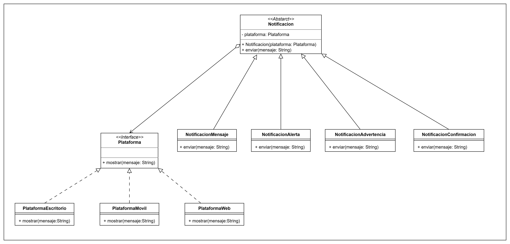
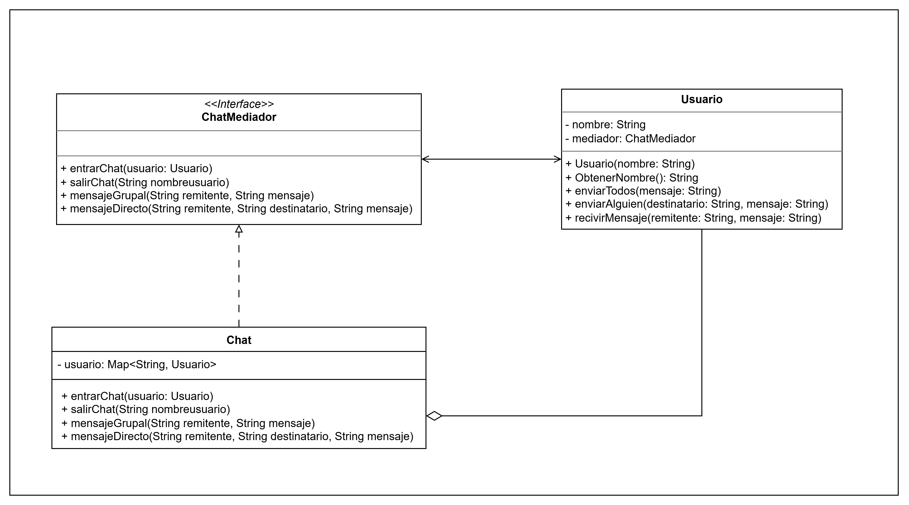

# 🧩 Patrones de diseño

Este proyecto explora diferentes enfoques arquitectónicos para dar solucion a diferentes esenarios de diseño
---

## 📘 Escenario 1: Patrón Builder (Creacional)

* Este escenario utiliza el patrón **Builder** para construir objetos, complejos paso a paso.

---

## 📗 Escenario 2: Patrón Bridge (Estructural)

* Este escenario aplica el patrón **Bridge** permite dividir una clase grande, o un grupo de clases estrechamente relacionadas, en dos jerarquías separadas.

---

## 📙 Escenario 3: Patrón Mediator (Comportamiento)

* Este escenario aplica el patrón **Mediator** Permite reducir las dependencias caóticas entre objetos.

---

## 🛠️ Integrantes

* Julian David Caicedo Pineda
* Miguel Felipe Hernandez Osorio
* Camilo Andrés Porras Martín
* Alexander Caballero Garcia
* Edward Daniel Porras Martin